The documentation here uses instructions from [IOHK repositories](https://github.com/input-output-hk) as a foundation, with additional info which we can contribute to where appropriate. Note that not everyone needs to build each component. You can refer to [architecture](basics.md#architecture) to understand and qualify which components you want to run.

##### Components

For most Pool Operators, simply building [cardano-node](Build/node-cli.md) should be enough. Use the below to decide whether you need other components:

```mermaid
graph TB
  A(Need to interact with <br/>HD Wallets or query<br/> pool metadata locally?)
  B(Need to explore <br/> blockchain locally?)
  C(Automate pool-ops <br/> tasks using <br/> menu navigations?)
  O{{Node}}
  P{{Graphql}}
  Q{{DBSync }}
  R{{Wallet}}
  S{{CNTools}}
  T{{Rest}}

O --x A --x R
O --x B
B --x P --x Q
B --x T --x Q
O --x C
C --x S
```



**The instructions are intentionally limited to cabal** to avoid wait times/availability of nix/docker files on, what we expect to be, a rapidly developing codebase - this will also help prevent managing multiple versions of instructions (at least for now).

Note that the instructions are predominantly focused around building Cardano components and OS/3rd-party software (eg: postgres) setup instructions are intended to provide basic information only.

###### Docker Builds

If you would like to go down the Docker route, the basic instructions to get you set up with Docker itself are below. Additionally, you can follow [IOHK Adrestia documentation](https://docs.cardano.org/projects/adrestia) for the latest release information:
``` bash
# CentOS
sudo yum-config-manager --add-repo https://download.docker.com/linux/centos/docker-ce.repo
sudo yum install https://download.docker.com/linux/centos/7/x86_64/stable/Packages/containerd.io-1.2.6-3.3.el7.x86_64.rpm
sudo yum install -y docker-ce docker-ce-cli
sudo systemctl enable docker
sudo chkconfig docker on

## These steps would be automatically performed by the install above
# sudo groupadd docker
# sudo usermod -aG docker $USER
sudo curl -L "https://github.com/docker/compose/releases/download/1.25.5/docker-compose-$(uname -s)-$(uname -m)" -o /usr/bin/docker-compose;chmod 755 /usr/bin/docker-compose
```
