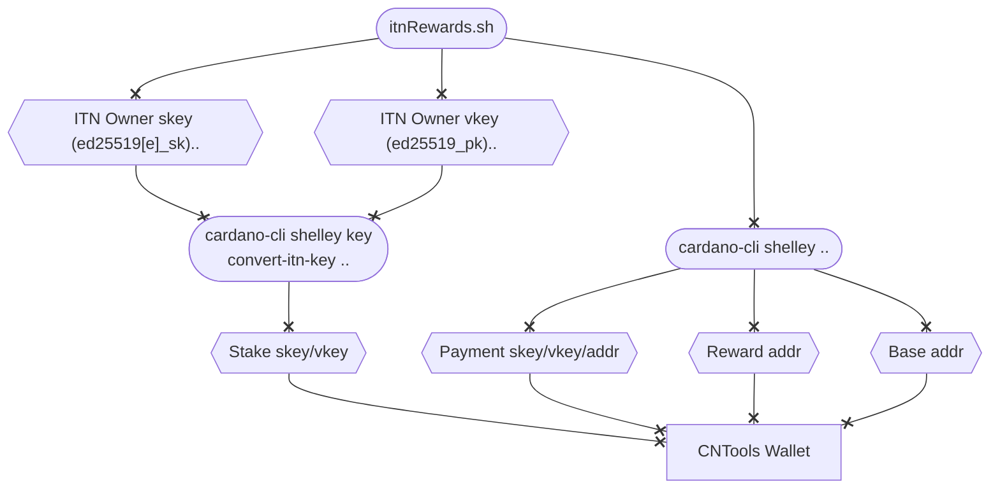

#### Concept

To claim rewards earned during the Incentivized TestNet the private and public keys from ITN must be converted to Shelley stake keys. A script called `itnRewards.sh` has been created to guide you through the process of converting the keys and to create a CNTools compatible wallet from were rewards can be withdrawn. 

<!--details>
<summary>Expand to view</summary-->



<!--/details-->

#### Steps

- If secret key used for jcli account in ITN was ed25519_sk (not extended), you can run the `itnRewards.sh` script providing the name for CNTools wallet and ITN owner _public_/_secret_ keys that was used to register your pool as below.
``` bash
cd $CNODE_HOME/scripts
./itnRewards.sh MyITNWallet ~/jormu/account/priv/owner.sk ~/jormu/account/priv/owner.pk
```
- Start CNTools and verify that correct balance is shown in the wallet reward address
- Fund base address of wallet with enough funds to pay for withdraw tx fee
- Use FUNDS >> WITHDRAW to move rewards to base address of wallet
- You can now spend/move funds as you see fit
