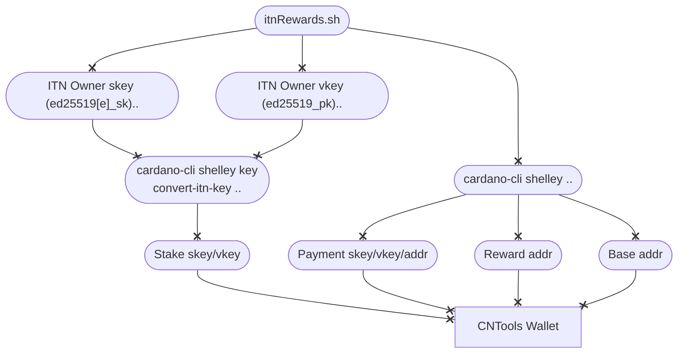

!!! warning "Historical documentation"
    This page describes the retired Incentivized Testnet reward workflow.
    `itnRewards.sh` is no longer present in the repository or installed by any
    current node profile. The commands below are retained only as historical
    reference and must not be treated as a supported deployment workflow.

#### Concept

The historical workflow converted Incentivized Testnet private and public keys
to Shelley stake keys, then used `itnRewards.sh` to create a CNTools-compatible
wallet.


```mermaid
graph TB
    A(["itnRewards.sh"])
    A --x B(["ITN Owner skey (ed25519[e]_sk).."]) --x D(["cardano-cli shelley key <br>convert-itn-key .."])
    A --x C(["ITN Owner vkey (ed25519_pk).."]) --x D
    D --x E(["Stake skey/vkey"]) --x L
    A --x F(["cardano-cli shelley .."])
    F --x G(["Payment skey/vkey/addr"]) --x L
    F --x H(["Reward addr"]) --x L
    F --x I(["Base addr"]) --x L
    L[CNTools Wallet]
    ;
```

#### Steps

- The retired workflow invoked `itnRewards.sh` with the CNTools wallet name and
  the ITN owner public and secret keys:
  ``` bash
  cd $CNODE_HOME/scripts
  ./itnRewards.sh MyITNWallet ~/jormu/account/priv/owner.sk ~/jormu/account/priv/owner.pk
  ```
- Start CNTools and verify that the correct balance is shown in the wallet reward address
- Fund base address of the wallet with enough funds to pay the withdraw tx fee
- Use `FUNDS >> WITHDRAW` to move rewards to the base address of wallet
- You can now spend/move funds as you see fit
