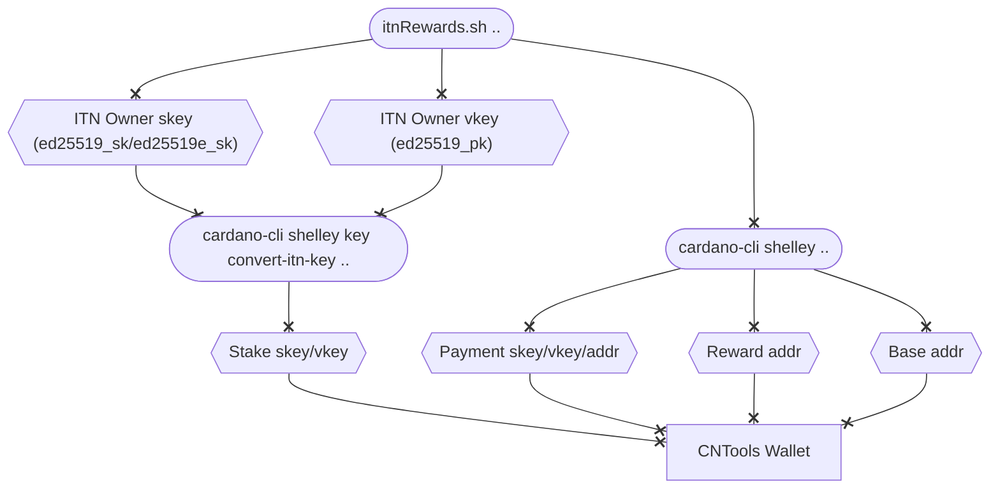

#### Concept

To claim rewards earned during the Incentivized TestNet the private and public keys from ITN must be converted to Shelley stake keys. A script called `itnRewards.sh` has been created to guide you through the process of converting the keys and to create a CNTools compatible wallet from were rewards can be withdrawn. 

<!--details>
<summary>Expand to view</summary-->



<!--/details-->

#### Steps
- Run the `itnRewards.sh` script providing the name for CNTools wallet and ITN owner _public_/_secret_ keys that was used to register your pool as below.
``` bash
itnRewards.sh MyITNWallet ~/jormu/account/priv/owner.sk ~/jormu/account/priv/owner.pk
```
- If an extended secret key was used(ed25519e_sk) a special version of cardano-cli is needed to convert the key.
- Follow these instructions to build this version of cardano-cli:
``` bash
# Go to folder where you normally build cardano-node
git checkout -b jordan/cli-handle-extended-itn-keys
git branch --set-upstream-to origin/jordan/cli-handle-extended-itn-keys jordan/cli-handle-extended-itn-keys
git pull
cabal clean
cabal update
cabal build cardano-cli 2>&1 | tee /tmp/build.log
cp -f $(grep "^Linking.*cardano-cli" /tmp/build.log  | awk '{print $2}') "$HOME/.cabal/bin/cardano-cli-itn"
```
- Re-run `itnRewards.sh` and provide the path $HOME/.cabal/bin/cardano-cli-itn when asked
- Start CNTools and verify that correct balance is shown in the wallet reward address
- Fund base address of wallet with enough funds to pay for withdraw tx fee
- Use FUNDS >> WITHDRAW to move rewards to base address of wallet
- You can now spend/move funds as you see fit
