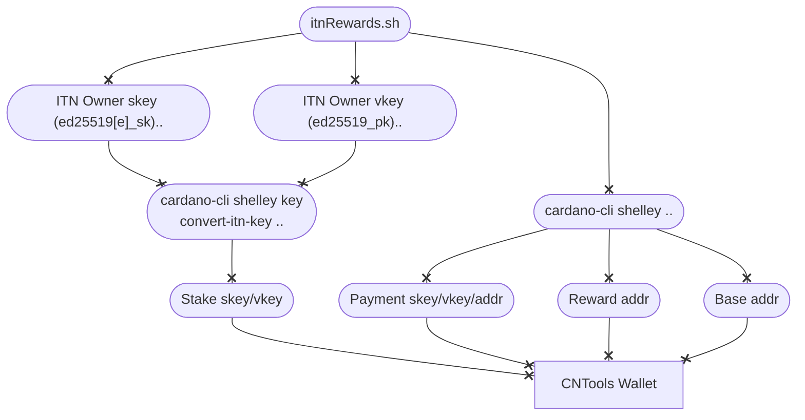

#### Concept

To claim rewards earned during the Incentivized TestNet the private and public keys from ITN must be converted to Shelley stake keys. A script called `itnRewards.sh` has been created to guide you through the process of converting the keys and to create a CNTools compatible wallet from were the rewards can be withdrawn. 



#### Steps

- If the secret key used for `jcli` account in ITN was ed25519_sk (not extended), you can run the `itnRewards.sh` script providing the name for the CNTools wallet and ITN owner _public_/_secret_ keys that were used to register your pool as below.
  ``` bash
  cd $CNODE_HOME/scripts
  ./itnRewards.sh MyITNWallet ~/jormu/account/priv/owner.sk ~/jormu/account/priv/owner.pk
  ```
- Start CNTools and verify that the correct balance is shown in the wallet reward address
- Fund base address of the wallet with enough funds to pay the withdraw tx fee
- Use `FUNDS >> WITHDRAW` to move rewards to the base address of wallet
- You can now spend/move funds as you see fit
