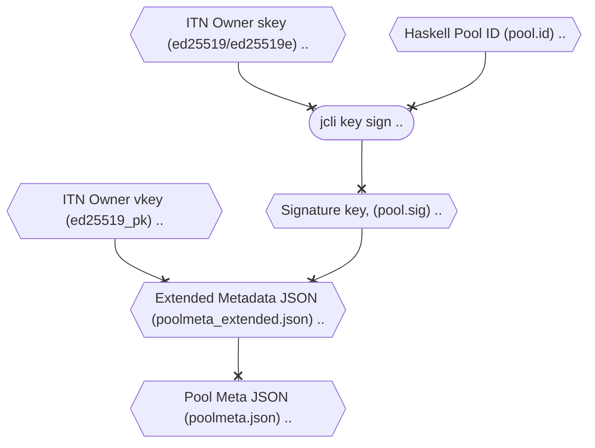

> ##### Disclaimer:
> - Currently this is to protect the existing pools from ITN who have already a delegator base to prevent spoofing against - to avoid scammers building on results of ITN from known pools. There would be a solution in future for Mainnet nodes too - but it doesnt apply to those in its current form.


#### Concept

Due to the expected Ticker spoofing attack for pools that were famous during ITN, some of the community members have proposed an interim solution to verify the legitimacy of a pool for delegators. You can check the high-level workflow below:

<!--details>
<summary>Expand to view</summary-->



<!--/details-->

#### Steps
The actual implementation is pretty straightforward, we will keep it brisk - as we assume ones participating are fairly familiar with `jcli` usage.
- You need to use your owner keys that was used to register your pool , and it should match the owner _public_ key you presented on [official cardano-foundation github](https://github.com/cardano-foundation/incentivized-testnet-stakepool-registry) while registering metadata.
- Store your pool ID in a file (eg: `mainnet_pool.id`)
- Sign the file using your owner secret key from ITN (eg: `owner_skey`) as per below:
``` bash
jcli key sign --secret-key ~/jormu/account/priv/owner.sk $CNODE_HOME/priv/pool/TEST/pool.id --output mainnet_pool.sig
cat mainnet_pool.sig
# ed25519_sig1sn32v3z...d72rg7rc6gs
```
- Add this signature and owner _public_ key to the extended pool JSON , so that it looks like below:
``` json
{
  "itn": {
    "owner": "ed25519_pk1...",
    "witness": "ed25519_sig1..."
  }
}
```
- Host this signature file online at a URL with raw contents easily accessible on internet (eg: https://my.pool.com/extended-metadata.json)
- When you register/modify a pool using CNTools, use the above mentioned URL to add to your pool metadata.

If the process is approved to appear for wallets, we may consider providing easier alternatives. If any queries about the process, or any additions please create a git issue/PR against guild repository - to capture common queries and update instructions/help text where appropriate.

#### Sample output of JSON files generated

- Metadata JSON used for registering pool (one that will be hosted URL used to define pool, eg: https://hosting.site/poolmeta.json)

``` json
{
  "name":"Test",
  "ticker":"TEST",
  "description":"For demo purposes only",
  "homepage":"https://hosting.site",
  "nonce":"1595816423",
  "extended":"https://hosting.site/poolmeta_extended.json"
}
```

- Extended Metadata JSON used for hosting additional metadata  (hosted at URL referred in `extended` field above, thus - eg : https://hosting.site/poolmeta_extended.json)

``` json
{
  "itn": {
    "owner": "ed25519_pk1...",
    "witness": "ed25519_sig1..."
  }
}
```
