The documentation here uses instructions from [IOHK repositories](https://github.com/input-output-hk) as a foundation, with additional info which we can contribute to where appropriate. Note that not everyone needs to build each component. You can refer to [architecture](basics.md#architecture) to understand and qualify which components you want to run.

##### Components

For most Pool Operators, simply building [cardano-node](Build/node-cli.md) should be enough. Use the below to decide whether you need other components:

```mermaid
graph TB
  A(Need to interact with <br/>HD Wallets or query<br/> pool metadata locally?)
  B(Need to explore <br/> blockchain locally?)
  C(Manage pool <br/> setup, maintenance <br/> tasks using <br/> menu navigations?)
  D(Create Custom Assets?)
  E(Monitor node <br/> using Terminal UI)
  O{{Node}}
  P{{PostgREST}}
  Q{{DBSync }}
  R{{Wallet}}
  S{{CNTools}}
  T{{*Rest}}
  U{{*GraphQL}}
  V{{Offline Metadata Tools}}
  X{{gLiveView}}

O --x E --x X
O --x C --x S
O --x D --x V
O --x B
B --x P --x Q
B --x T --x Q
B --x U --x Q
O --x A --x R
```

> We have retired usage of Rest/GraphQL components from guild website due to lack of advantages over PostgREST , as well as simplicity/not having to work with/mix different technologies for base layer itself.

**The instructions are intentionally limited to stack/cabal** to avoid wait times/availability of nix/docker files on, what we expect to be, a rapidly developing codebase - this will also help prevent managing multiple versions of instructions (at least for now).

Note that the instructions are predominantly focused around building Cardano components and OS/3rd-party software (eg: postgres) setup instructions are intended to provide basic information only.

