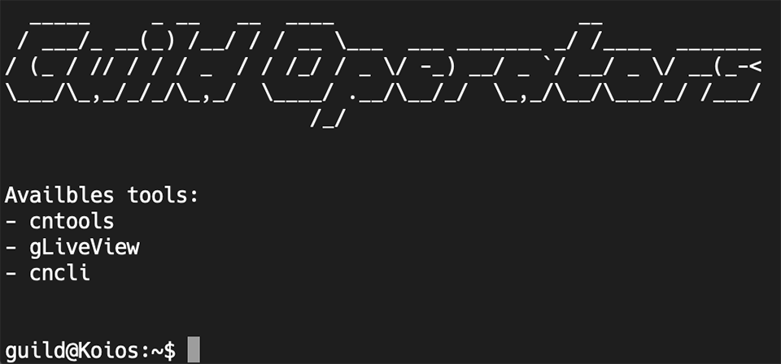
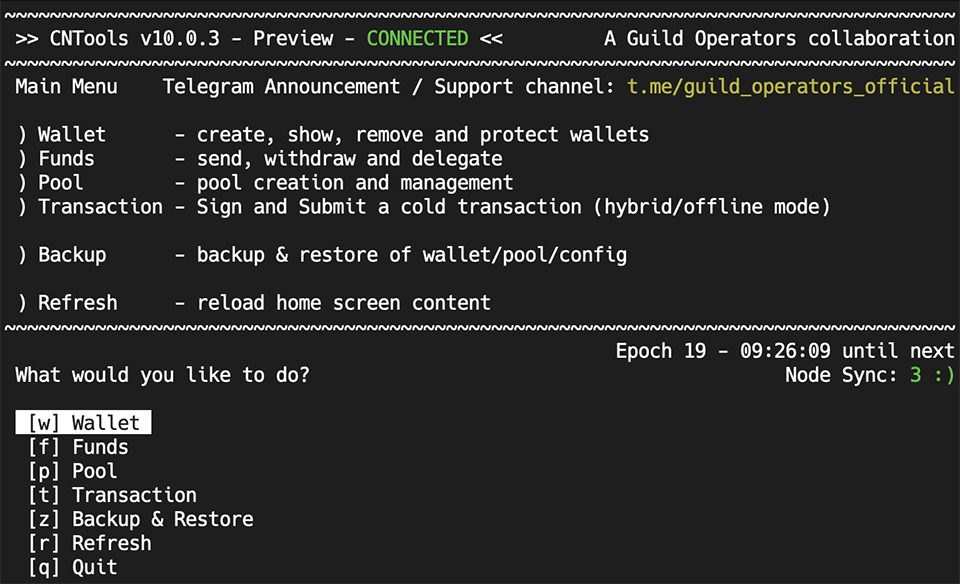
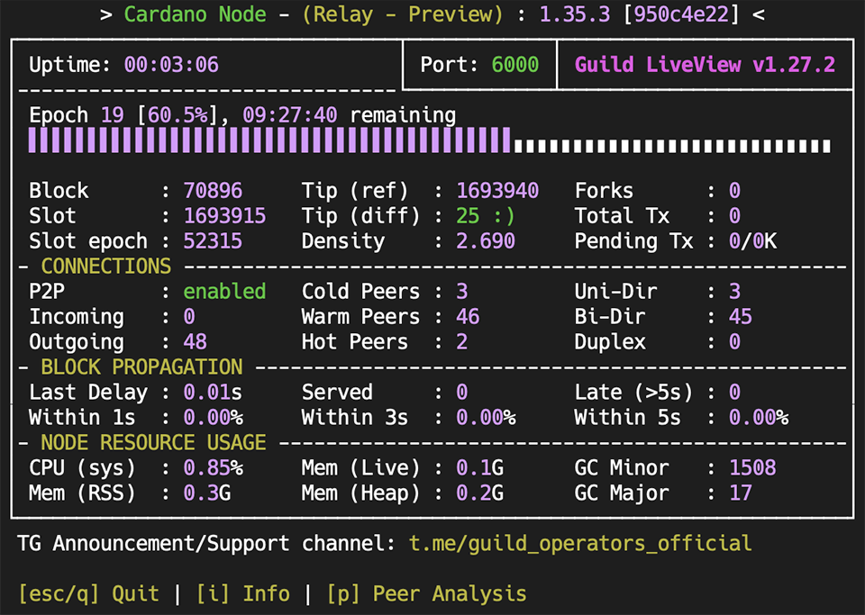
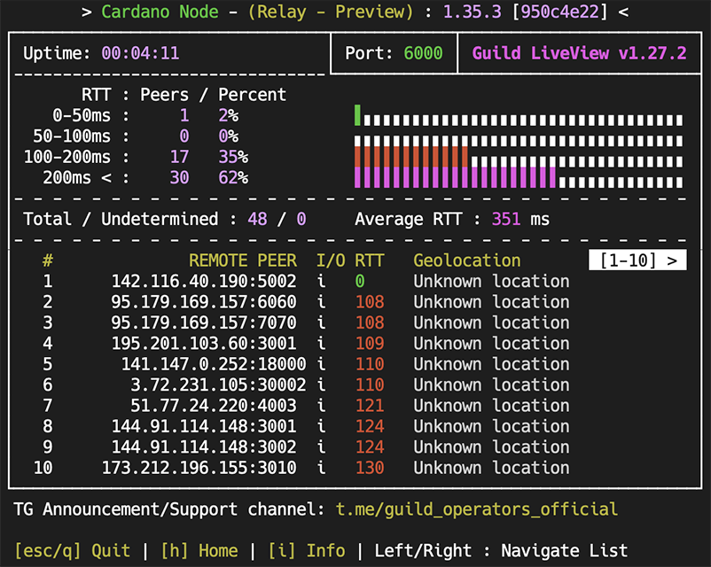
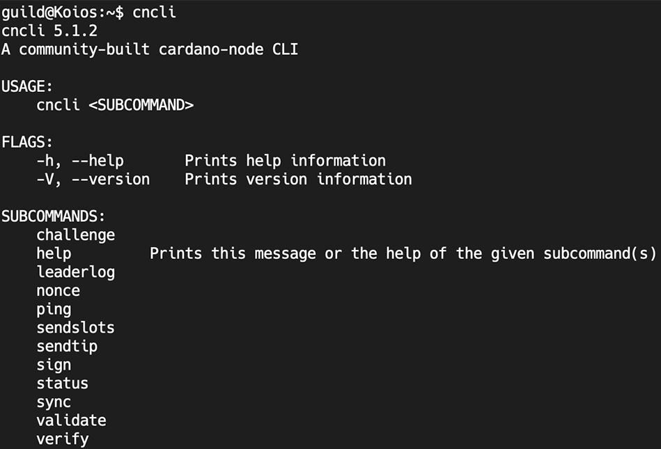

Running your own Cardano node has never been so fast and easy.

!!! info ""
    But first, a kind reminder to the [security aspects of running docker containers](../docker/security.md).

### External resources

- [DockerHub Guild's images](https://hub.docker.com/u/cardanocommunity)
- [YouTube Guild's Videos](https://www.youtube.com/channel/UC1eg3ljUWjIHeU0Vpqicj6A)

### 🔔 Built-in Cardano software

- cardano-address
- cardano-cli
- cardano-hw-cli
- cardano-node
- cardano-ping
- cardano-submit-api

### 🔔 Built-in tools

- CNTools
- gLiveView
- CNCLI
- Monitoring ready (with EKG and Prometheus)

#### Docker Splash screen

#### Cntools 

#### gLiveView

#### gLiveView Peers analyzer 

#### CNCLI

#### Guild Operators Docker strategy ( mainnet/ testnet / preview / preprod / guild)  {: id="strategy"}

Modular docker images based on Debian.

Based on the Guild's work we decided to build the Cardano Node images in 3 stages:

- 1st stage: it uses `prereq.sh` to prepare the development enviroment before compiling the node source code.  -> [Stage1](https://github.com/cardano-community/guild-operators/blob/master/files/docker/node/dockerfile_stage1)
- 2nd stage: based on stage1, this stage intent is to compile and produce the binaries of the node. -> [Stage2](https://github.com/cardano-community/guild-operators/blob/master/files/docker/node/dockerfile_stage2)
- 3rd stage: based upon a minimal debian image it incorporates the node's binaries as well as all the Guild's tools. -> [Stage3](https://github.com/cardano-community/guild-operators/blob/master/files/docker/node/dockerfile_stage3)

### Additional docs

If you prefer to build the images your own than you can check:

- [Docker Build Documentation](../docker/build.md)
- [Docker Tips](../docker/tips.md)

### Port mapping

 The dockerfiles are located in ./files/docker/

| Node Ports        |  Wallet Ports      | Flavor        |
| ------------:     | -------------:     |:-------------:|
| Node  (6000)      | Wallet (8090)      | Debian        |
| Prometheus (12798)| Prometheus (12798) |               |
| EKG (12781)       |                    |               |
