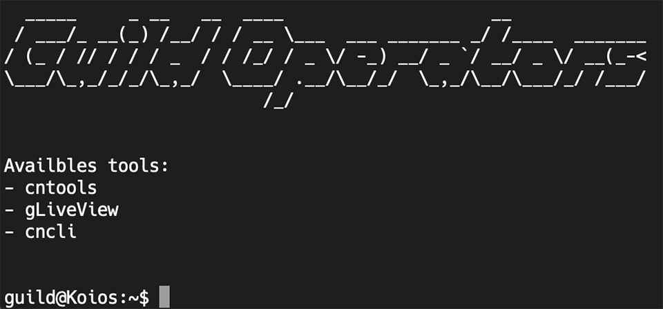
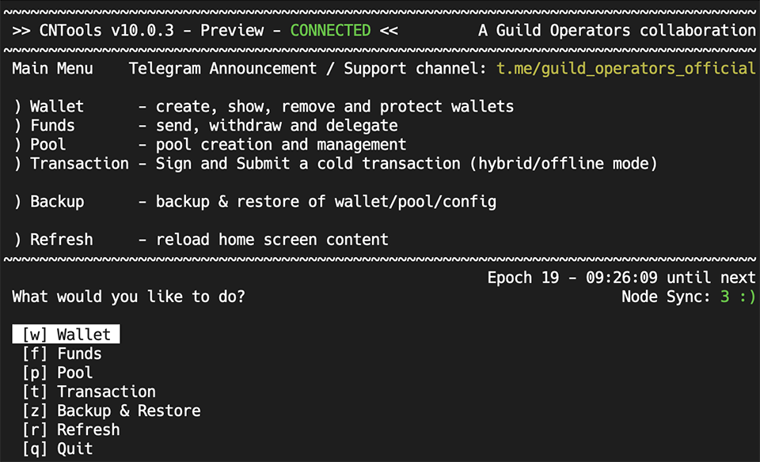
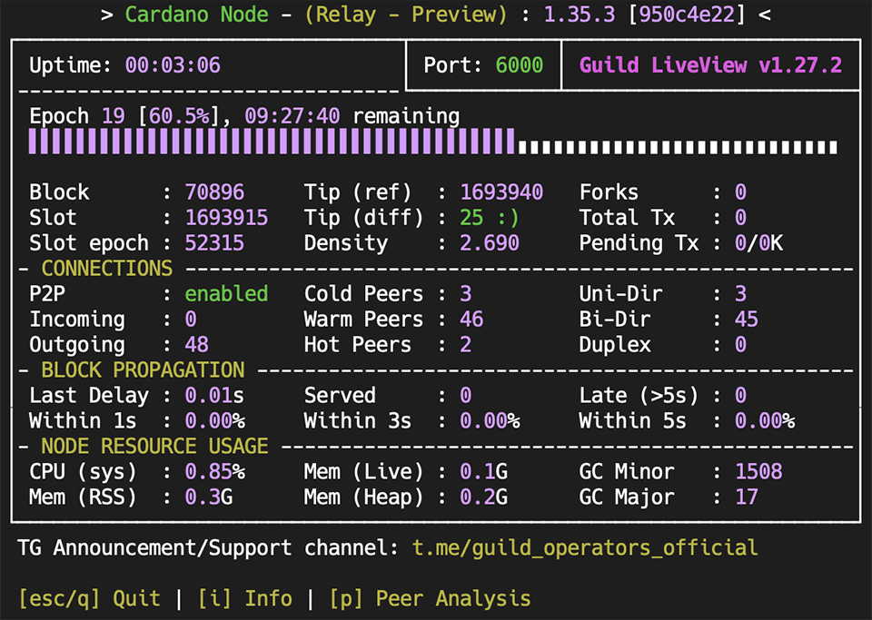
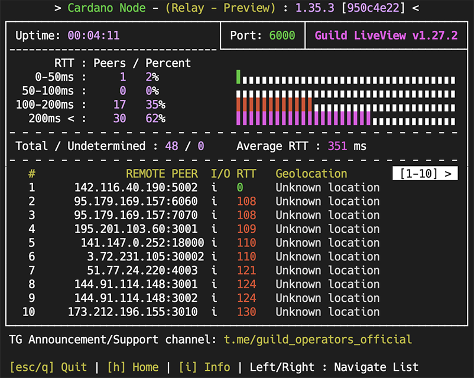
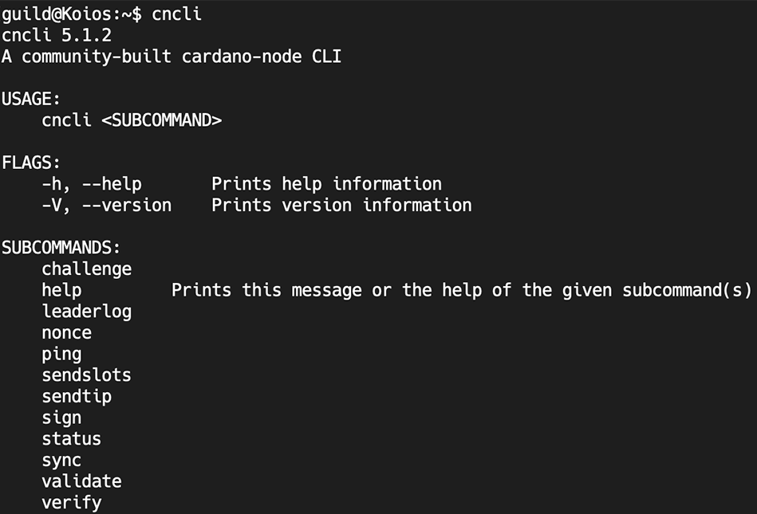

Running your own Cardano node has never been so fast and easy.

!!! info ""
    But first, a kind reminder to the [security aspects of running docker containers](../docker/security.md).

### External resources

- [DockerHub Guild's images](https://hub.docker.com/u/cardanocommunity)
- [YouTube Guild's Videos](https://www.youtube.com/channel/UC1eg3ljUWjIHeU0Vpqicj6A)

### Node implementations

The Dockerfile uses the node-agnostic Guild Operators dispatcher and accepts
`NODE_IMPLEMENTATION=cnode|dingo|amaru` as a build argument. cnode remains the
default and carries the broader cnode helper payload described below. Dingo
and Amaru images are experimental and limited to preprod and preview. Dingo
can run as a relay or testnet block producer; Amaru is relay-only.

The build-context dispatcher is only a seed. One invocation prepares and
re-executes an exact managed Git snapshot, installs the complete node target,
and exports the Docker-only supplement from that same revision. Production and
workflow builds pin the mandatory `GUILD_DEPLOY_REVISION` to the full commit
SHA. Runtime payload refresh is rejected; updates are made by rebuilding and
recreating the container from another reviewed exact revision. The target
and Docker supplement have separate, cross-linked source receipts; see the
[build guide](build.md) for their paths and manual build arguments.

Implementation and network are fixed at build time and recorded in
`.deployment.json`. A runtime override that contradicts the manifest is
rejected; build another image to change either value.

See [Docker Build Documentation](build.md) for examples and the distinction
between the production Docker Hub image and testing images in GitHub Container
Registry.

### cnode software and tools

The default cnode image includes the established Cardano and Guild Operators
payload:

- cardano-node and cardano-cli
- cardano-address and cardano-submit-api
- CNTools and gLiveView
- CNCLI and Ogmios
- Cardano Hardware CLI and Cardano Signer
- Prometheus-ready monitoring

The stock image copies the Mithril client, signer, and relay wrapper scripts
for compatibility, but its current build flags do not install the corresponding
Mithril binaries. Those wrappers and `MITHRIL_DOWNLOAD` are usable only in a
reviewed derived image that also runs the cnode `m` deployment selection.

The release artifacts installed directly by `guild-deploy.sh` are selected
through the single cnode release manifest described in
[the cnode deployment guide](../Build/cnode.md#release-metadata). This applies
the same concrete/latest selection and checksum verification to host and image
builds.

Dingo and Amaru images install their node binary, native configuration,
common deployment runtime, launcher, gLiveView, and container healthcheck.
Their image builds resolve the newest published non-draft node release,
including prereleases, and enforce the selected GitHub asset digest. Dingo
also installs CNTools and an independently pinned `cardano-cli-dingo`, and
uses its native Prometheus endpoint. Amaru includes the pinned
OpenTelemetry Collector and Amaru-derived bridge profile used to provide
gLiveView metrics. Compatibility with the remaining cnode-oriented tools has
not been verified, so those tools are intentionally not included.

#### Docker Splash screen

#### Cntools 

#### gLiveView

The screenshot shows the established cnode layout. Dingo and Amaru use the
same dashboard entrypoint with an implementation label and dynamically hide
metrics their adapters do not expose.

#### gLiveView Peers analyzer 

#### CNCLI

#### Guild Operators Docker strategy  {: id="strategy"}

Modular docker images based on Debian.

The node image is built in a single stage using
[dockerfile_bin](https://github.com/cardano-community/guild-operators/blob/master/files/docker/node/dockerfile_bin).

- Uses `guild-deploy.sh` to:
  - Install the os prerequisites
  - Deploy the selected node implementation from verified release binaries
  - Install the implementation's configuration and compatible helper set
  - Create authoritative deployment metadata and a complete payload receipt
  - Export separately receipted Docker-only files from the same source revision

### Additional docs

To build and run the images yourself, see:

- [Docker Build Documentation](build.md)
- [Run the images](run.md)
- [Docker Tips](tips.md)
- [Docker security](security.md)

### Port mapping

The Docker assets are under `files/docker/node/`. Ports below are internal
defaults; publish only the endpoints the host actually needs.

| Implementation | Relay port | Metrics/API |
| --- | ---: | --- |
| cnode | 6000 | Prometheus 12798 |
| Dingo | 3001 | Prometheus 12798; protect it with a firewall |
| Amaru | 3000 | Loopback OTLP/gRPC 4317 and Prometheus 8889; submit API disabled |

The Amaru telemetry ports are internal loopback listeners and should not be
published. The container entrypoint supervises both Amaru and its local
collector; if either exits, the entrypoint stops the other process and exits.
